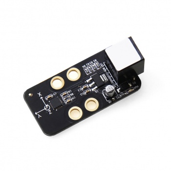
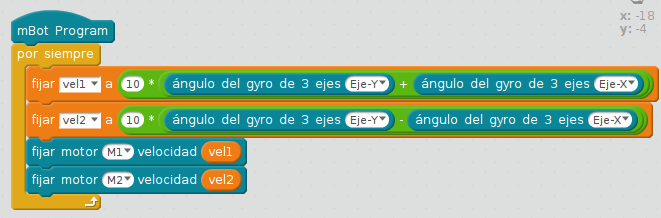

# Acelerómetro y Gyro 3 ejes

El [acelerómetro gyro 3 ejes ](https://www.makeblock.es/productos/sensor_acelerometro_gyro/)detecta en grados su inclinación en tres ejes:

Su función en mBlock es la siguiente: 

En teoría como se puede ver [en esta página de Makeblock.com](https://www.makeblock.es/productos/sensor_acelerometro_gyro/) puede comunicar los grados al mBloc pero no nos ha funcionado (_en la versión 3.4, a lo mejor con la actual ya funciona_).

**Sólo nos ha funcionado con el robot funcionando independientemente del ordenador = modo autónomo**. ([Upload to Arduino](http://aularagon.catedu.es/materialesaularagon2013/mbot/M3/upload_to_arduino.html))

Si tienes deriva en el eje Z aquí tienes a solución [vídeo youtube](https://www.youtube.com/watch?v=EpmbZtbfs9Y)

## Reto

Suponte que quieres hacer un mando con el giroscopio.

Es decir, si lo inclinamos sobre el eje y va hacia delante o hacia atrás

Y si lo inclinamos sobre el eje x que gire a un lado o a otro

Un vídeo lo explica mejor:

https//www.youtube.com/watch?v=lczO3UDKwaQ

%accordion%Solución%accordion%

el 10* es porque los grados son demasiado pequeños para hacer una velocidad rápida.

%/accordion%

