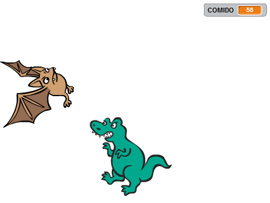
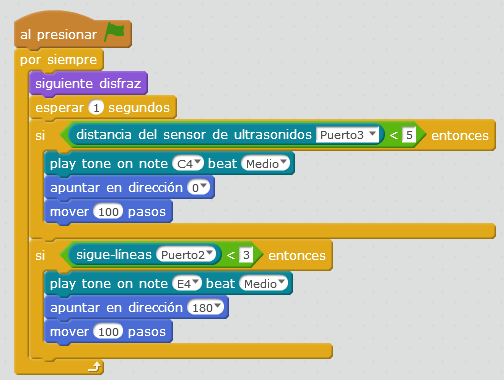
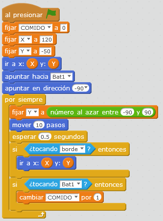

# Come-dinosaurio

## Reto

Siempre podemos interactuar con los elementos de Scratch, la siguiente propuesta el dinosaurio se mueve de izquierda a derecha pero al azar en altura.

El murciélago tiene que esquivarlo ¿cómo? volando arriba o abajo pero.... con el robot

- Si ponemos la mano delante del sensor de ultrasonidos, vuela hacia arriba
- Si ponemos la mano abajo (o algo negro, o levantando simplemente el robot) vuela hacia abajo
- La variable COMIDO cuenta las veces que el dinosaurio toca al murciélago

%accordion%Solución%accordion%

Aquí está la respuesta

[[Fichero de descarga](http://aularagon.catedu.es/materialesaularagon2013/mbot/M1plus/comer-bat-dino.sb2)]

Programa murciélago:

Programa del dinosaurio:

%/accordion%

La interacción de elementos de Scratch, como este caso el dinosario y el murciélago con sensores del mBot, es un recurso para que el producto final sea totalmente interactivo con elementos físicos diferentes al teclado y ratón. 

En este vídeo podemos ver un ejemplo:

https//www.youtube.com/watch?v=iBxDagF3F40
