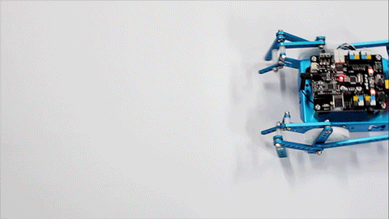
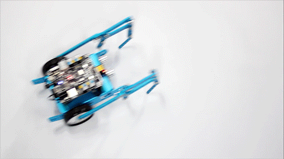
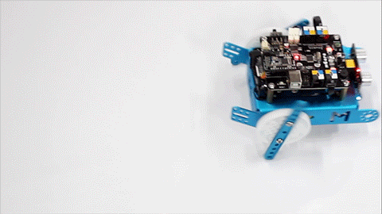
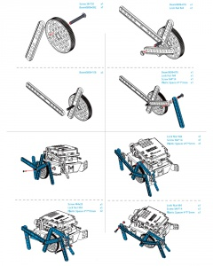

# Escarabajos

Este[ kit de patas](https://www.makeblock.es/productos/mbot_patas/) nos puede proporcionar tres tipos de construcciones:

## Escarabajo

## Mantis

## La rana

Esta construcción no lo hemos probado por los posibles daños que pueda producir, la verdad es que da algo de lástima el pobre:

## Construcción

El mismo kit muestra paso por paso cómo realizarlo, es un ejercicio de PACIENCIA más que de programación, y hay ser fiel a las figuras, sobre todo la orientación de las piezas, agujeros, etc... un sólo error y no funciona:

## Propuesta

El escarabajo no permite una programación distinta a la del mBot normal, pero sí que es un elemento motivador, o el mismo ejercicio parece otro distinto. Nuestra propuesta es realizar un programa que el escarabajo no salga de una línea cerrada:

https//www.youtube.com/watch?v=57TA3fhdEGU
<input type="button" name="toggle-feedback-1_93" value="Solución" class="feedbackbutton" onclick="$exe.toggleFeedback(this,false);return false" />

### Retroalimentación

La solución ya la vimos en el [Módulo 2 sensor de línea](http://aularagon.catedu.es/materialesaularagon2013/mbot/M2/sensor_de_lnea.html), es exáctamente igual:

Este programa funciona mejor grabandolo en el Arduino

