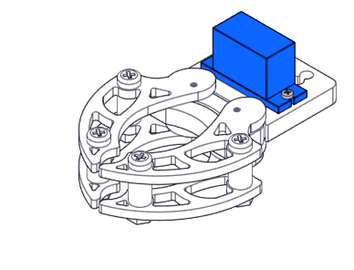

# Garra y el brazo articulado

En esta sección vamos a utilizar la [minigarra ](https://www.makeblock.es/productos/mini_garra_robotica/)junto con el [brazo articulado](https://www.makeblock.es/productos/mini_brazo_robotico/) para dar más potencial a nuestra construcción, si colocamos el brazo tal y como está en la foto, nos permite mover el eje en los ejes Y y X, para el eje Z se puede utilizar el movimiento de giro propio de mBot.

La minigarra tiene un servo, y el brazo articulado tiene 2 servos, por lo tanto tenemos que utilizar [2 adaptadores RJ45](https://www.makeblock.es/productos/adaptador_rj25/), dejando libre un slot, esto nos ocupa dos puertos, el otro puerto utilizaremos el[ sensor de línea ](http://aularagon.catedu.es/materialesaularagon2013/mbot/M2/sensor_de_lnea.html)pues nos permitirá mover el mBot por el camino que deseemos, y el otro puerto podemos utilizarlo para la [matriz ](http://aularagon.catedu.es/materialesaularagon2013/mbot/M2/matriz_led.html)o para el [sensor distancia](http://aularagon.catedu.es/materialesaularagon2013/mbot/M2/sensor_distancia.html)

Nosotros elegiremos la matriz, pues el sensor de distancia nos ha dado problemas (seguramente por los picos provocados por los servos).

**La garra no es muy fuerte**, igual que el brazo, por lo tanto NO FORZARLO CON PESOS ELEVADOS, se romperán los engranajes de plástico interiores de los servos (ver [Ojo con los servos](ojo_con_los_servos.html)), nosotros recomendamos un rollo de cartón por ejemplo higiénico pero de diámetro inferior, se puede hacer casero con un folio y celo.

OJO con el brazo articulado: Su construcción es compleja, no recomendable para delegarlo a los alumnos. La U formada por la parte metáliza y las piezas de plástico transparente, si están algo abierto (flechas verdes) hace que el relé A que está enmedio de la U se caiga constantemente, hay que ajustar la U lo suficiente para que entre el relé primero entrando el relé A, luego colocar el tornillo B y finalmente el relé exterior, en ese orden, de lo contrario estaremos obligados a abir la U para colocar el relé A y se caerá constantemente.

