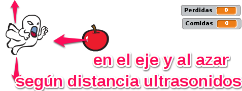
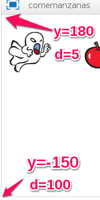
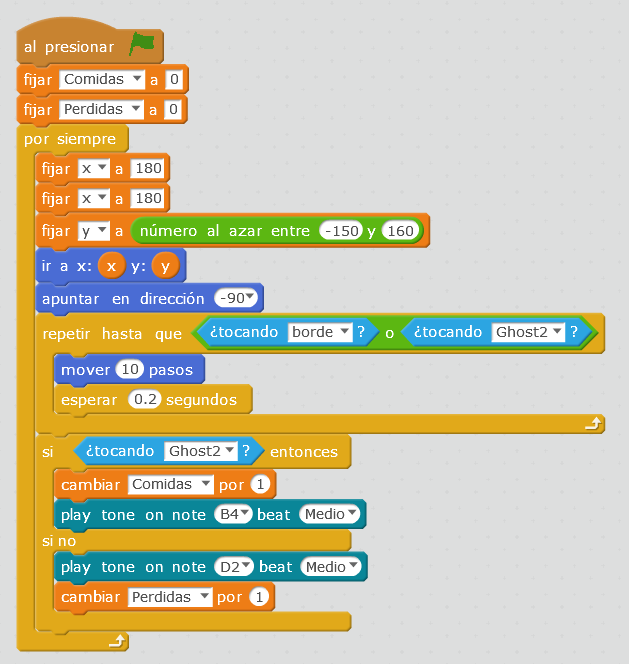
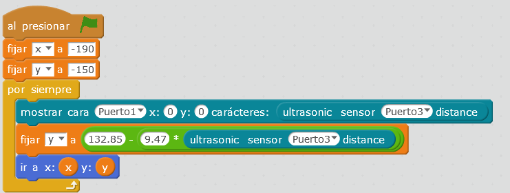

# Matemáticas y robótica

## Propuesta

## Nivel 4ºESO BACH APLICACIÓN DE LAS MATEMÁTICAS A LA ROBÓTICA

Es importante que no perdamos que el mBot PUEDE INTERACCIONAR con los personajes del mBlock (o Scratch) ENRIQUECIENDO LA INTERACCIÓN

El siguiente ejemplo, el fantasma se mueve verticalmente SEGUN LA DISTANCIA d DE ULTRASONIDOS y la manzana se mueve horizontalmente y la posición vertical es aleatoria:

Hay dos contadores para cuantificar las manzanas ganadas o perdidas, un vídeo es la mejor muestra:

https//www.youtube.com/watch?v=xmPKqIwFBIU?wmode=transparent
<input type="button" name="toggle-feedback-10_93" value="Solución" class="feedbackbutton" onclick="$exe.toggleFeedback(this,false);return false" />

### Retroalimentación

El programa [te lo puedes descargar aquí](http://localhost:51235/M1plus/resources/comemanzanas.sb2)

## MATEMÁTICAS

se ha fijado como criterio la distancia de 5cm arriba del todo (y=180) y la distancia de 40cm abajo del todo (y=-150).

Tenemos que convertir la distancia d que mide el robot con la variable y con una regresión lineal y= m + n * d tenemos un sistema de ecuaciones con las dos condiciones anteriores:

- -150=m+n*40
- 180=m+n*5

Resolviendo sale m=132.85 y n=-9.47 luego la ecuación de la y es y=132.85-9.47*d donde d es la distancia del sensor de ultrasonidos

## Manzana

## Fantasma

