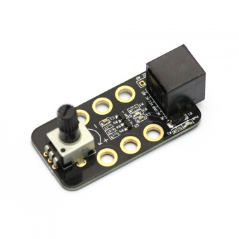
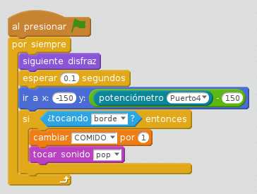
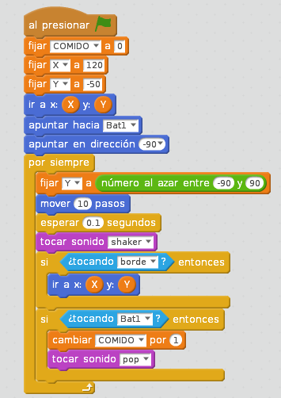

# Potenciómetro

El potenciómetro indica en grados el giro que le damos en su mando:

Al ser negro, sólo se puede usar el puerto 3 o 4. La instrucción en mBlock es la siguiente:

## Un caso práctico

El potenciómetro permite interactuar con el movimiento de un personaje de mBlock, enriqueciendo un video-juego:

- El dinosaurio se mueve continuamente en el eje x y aleatoriamente en el eje y
- El murciélago tiene fijo el x pero el y está sujeto al valor del potenciómetro
- Si el murciélago toca el borde exterior o toca el dinosario se suma un punto en COMIDO

https//www.youtube.com/watch?v=ZvD6cPm6L-0
<input type="button" name="toggle-feedback-5_93" value="Mostrar retroalimentación" class="feedbackbutton" onclick="$exe.toggleFeedback(this,true);return false" />

### Retroalimentación

La solución es:

Programa del murciélago:

Programa del dinosaurio

[Descarga del programa](http://aularagon.catedu.es/materialesaularagon2013/mbot/fuentes/comer-bat-dino-potenciometro.sb2)

