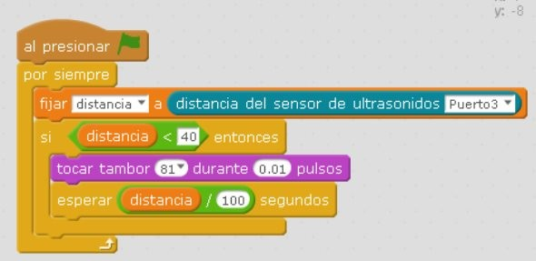

# Radar

## Radar

Con el sensor a distancia podemos hacer que se oiga el zumbador de forma intermitente pero con una frecuencia más rápida si el obstáculo está mas cerca. Igual que los "asistentes de aparcamiento" de los coches.

%accordion%Solución%accordion%

%/accordion%

