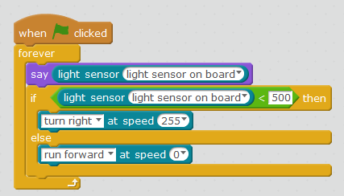

# Robot polilla

## Propuesta

Realizar un programa que "siga la luz"

https//www.youtube.com/watch?v=8rucCGgt1gs
<input type="button" name="toggle-feedback-5_93" value="Solución" class="feedbackbutton" onclick="$exe.toggleFeedback(this,false);return false" />

### Retroalimentación

