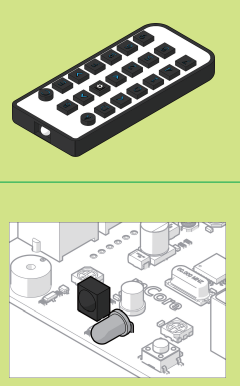
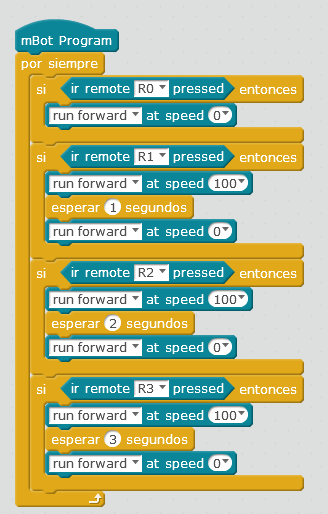

# Sensor IR

El sensor de IR puede recibir del mando números, letras A-D, flechas y el botón configuración. Ojo: El mando no es exclusivo de un robot, es decir, los demás robots del aula reciben las misma información, lo importante es apuntar el mando a los sensores del robot y no a otro:

Fuente: Tutorial de [http://makeblock.es](http://makeblock.es/)

Realizar programas con el sensor de IR tiene una dificultad:** NO SE PUEDE HACER A TRAVÉS DEL ORDENADOR** es decir, no se puede realizar como lo hemos hecho hasta ahora: Bandera y comunicación entre PC y mBot ¿Por qué? porque el mBot tiene instalado en esta configuración el programa por defecto **Firmware** de leer el mando, y no podemos saltarlo. **Ver M1 Dos formas de funcionar mBot.**

¿Cómo pues? Utilizando la otra configuración:** mBot independiente del ordenador**, con la desventaja de no poder interactuar con los elementos de Scracth, para usar este modo, hay que consultar el [M3 en el apartado** Upload to Arduino**](http://aularagon.catedu.es/materialesaularagon2013/mbot/M3/upload_to_arduino.html): 

Otro programa interesante es el que convierte mBot en un robot apropiado para **infantil**, utilizando el mando a distancia: Ver módulo anterior

## Ejemplo de uso

Un simple programa:

- Si apreto al 0 se para
- Si apreto al 1 que se mueva durante 1 segundo
- Si apreto al 2 que se mueva durante 2 segundos
- Si apreto al 3 que se mueva durante 3 segundos

<input type="button" name="toggle-feedback-13_93" value="Mostrar retroalimentación" class="feedbackbutton" onclick="$exe.toggleFeedback(this,true);return false" />

### Retroalimentación

