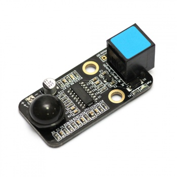
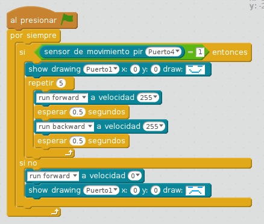

# Sensor PIR

El [sensor PIR de movimiento](https://www.makeblock.es/productos/sensor_movimiento_pir/) se usa para detectar personas o animales en un rango de hasta 6m. Si se mueve algo dentro de ese rando el sensor activa la salida digital SIG a alto. Mediante un potenciómetro soldado en el módulo podrás ajustar el rango de detección. Nota: Justo en el momento de alimentarlo deberás esperar unos 10 segundos a que el sensor se inicialice.

## Me pongo contento si te veo

¿Que tal si se pone contento al vernos?

https//www.youtube.com/watch?v=cwKVYvKgaF0
<input type="button" name="toggle-feedback-20_93" value="Mostrar retroalimentación" class="feedbackbutton" onclick="$exe.toggleFeedback(this,true);return false" />

### Retroalimentación

## Otro ejemplo

Un ejemplo podría ser que detecte una persona, y el panda del mBlock nos salude. [[fuente makeblock.com](http://learn.makeblock.com/me-pir-motion-sensor/)]

<input type="button" name="toggle-feedback-19_93" value="Mostrar retroalimentación" class="feedbackbutton" onclick="$exe.toggleFeedback(this,true);return false" />

### Retroalimentación

