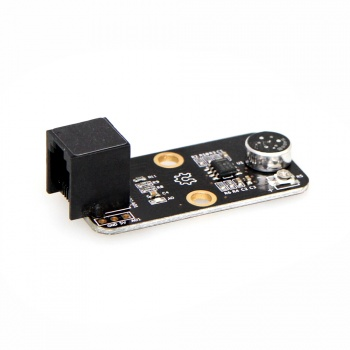
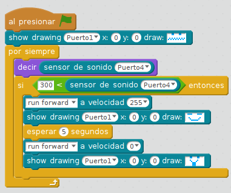

# Sensor sonido

El sensor de sonido mide la intensidad de sonido, siendo un valor de silencio próximo al 100 y un valor alto más de 300 aproximadamente

## Reto

El perrito faldero, le dices **¡VEN!** y viene, y se para al cabo de unos segundos:

https//www.youtube.com/watch?v=oxm8_-6R00M

%accordion%Solución%accordion%

%/accordion%
