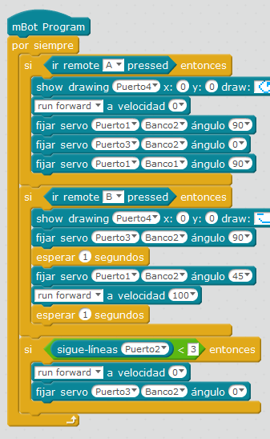

# Tira latas automático

## Propuesta

Esta vez, vamos a automatizar el proceso.

- Al apretar la tecla A del mando IR la garra baja, y se abre
<li>Al apretar la tecla B
<ul>
- Cierra la garra
- Se mueve hacia delante hasta que encuentra una línea negra
- Abre la garra

https//www.youtube.com/watch?v=LWv8rsLbcSA
<input type="button" name="toggle-feedback-5_93" value="Solución" class="feedbackbutton" onclick="$exe.toggleFeedback(this,false);return false" />

### Retroalimentación

Por ejemplo para  la siguiente configuración (puedes conectarlo como quieras, pero en esta solución conectamos los puertos y los slots a los servos siguientes:
|**Efecto**|**Puerto**|**Slot**|**Ángulo**|**Servo**
|Cerrar la garra|3|2|90º|garra
|Abrir la garra|3|2|0º|garra
|Garra en horizontal|1|1|90º|El de dentro del U del brazo articulado
|Garra balanceo derecha|1|1|0º|El de dentro del U del brazo articulado
|Garra balanceo izquierda|1|1|180º|El de dentro del U del brazo articulado
|Garra arriba|1|2|45º|El de fuera del brazo articulado
|Garra abajo|1|2|90º|El de fuera del brazo articulado

POR SUPUESTO ESTE PROGRAMA SÓLO SE PUEDE EJECUTAR SI LO GRABAMOS EN EL ARDUINO (o el mando IR no nos hará caso, pues por defecto tiene su configuración de fábrica)

Puedes descargarte el programa [aquí](TIRALATAS.sb2) (sb2 - 75.19 <abbr lang="en" title="KiloBytes">KB</abbr>).

