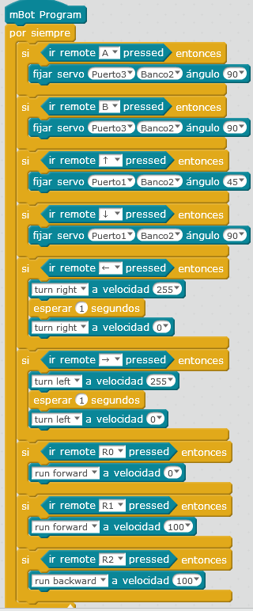

# Tira latas con mando

## Propuesta

Igual que el tira latas con teclado se puede hacer con mando, y tenemos un teledirigido capaz de coger las cosas... sólo hay que inventarse las teclas 

https//www.youtube.com/watch?v=KwpUU2HgmJI
<input type="button" name="toggle-feedback-7_93" value="Solución" class="feedbackbutton" onclick="$exe.toggleFeedback(this,false);return false" />

### Retroalimentación

Por ejemplo para  la siguiente configuración (puedes conectarlo como quieras, pero en esta solución conectamos los puertos y los slots a los servos siguientes:
|**Efecto**|**Tecla**|**Puerto**|**Slot**|**Ángulo**|**Servo**
|Cerrar la garra|C|3|2|90º|garra
|Abrir la garra|A|3|2|0º|garra
|Garra en horizontal|B|1|1|90º|El de dentro del U del brazo articulado
|Garra balanceo derecha|E|1|1|0º|El de dentro del U del brazo articulado
|Garra balanceo izquierda|F|1|1|180º|El de dentro del U del brazo articulado
|Garra arriba|Flecha arriba|1|2|45º|El de fuera del brazo articulado
|Garra abajo|Flecha abajo|1|2|90º|El de fuera del brazo articulado
|Mover hacia delante|1||||
|Mover hacia atrás|2||||
|Parar|0||||
|Girar derecha|flecha derecha||||
|Girar izquierda|flecha izquierda||||

POR SUPUESTO ESTE PROGRAMA SÓLO SE PUEDE EJECUTAR SI LO GRABAMOS EN EL ARDUINO (o el mando IR no nos hará caso, pues por defecto tiene su configuración de fábrica)

Puedes descargarte el programa [aquí](TIRALATASMANDOIR.sb2) (sb2 - 75.12 <abbr lang="en" title="KiloBytes">KB</abbr>).

