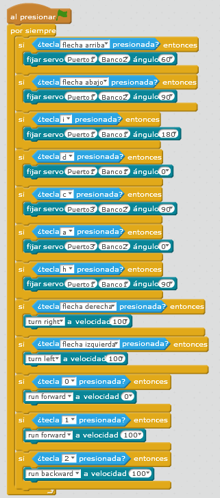

# Tira latas con teclado

## Propuesta

Realizar un programa que utilizando el teclado del ordenador, pueda manipular un objeto

La propuesta puede ser:

- Tecla C Cierra la garra
- Tecla A Abre la garra
- Tecla H coloca la garra en una posición Horizontal
- Tecla D balancea la garra hacia la derecha
- Tecla I balancea la garra hacia la izquierda
- Tecla flecha derecha gira el robot hacia la derecha
- Tecla flecha izquierda gira el robot hacia la izquierda
- Tecla fecha arriba mueve la garra arriba
- Tecla flecha abajo mueve la garra abajo
- Tecla 1 mueve el robot hacia delante
- Tecla 2 mueve el robot hacia detrás
- Tecla 0 para el robot

en fin.... es una propuesta, se puede hacer como se quiera

https//www.youtube.com/watch?v=k01opsw0RXM

%accordion%Solución%accordion%

Por ejemplo para  la siguiente configuración (puedes conectarlo como quieras, pero en esta solución conectamos los puertos y los slots a los servos siguientes:

Puedes descargarte el programa [aquí](http://aularagon.catedu.es/materialesaularagon2013/mbot/M3plus/PINZAS-CIERRA-ABRE-CONTECLADO.sb2) (sb2 - 75.12 <abbr lang="en" title="KiloBytes">KB</abbr>).

%/accordion%

